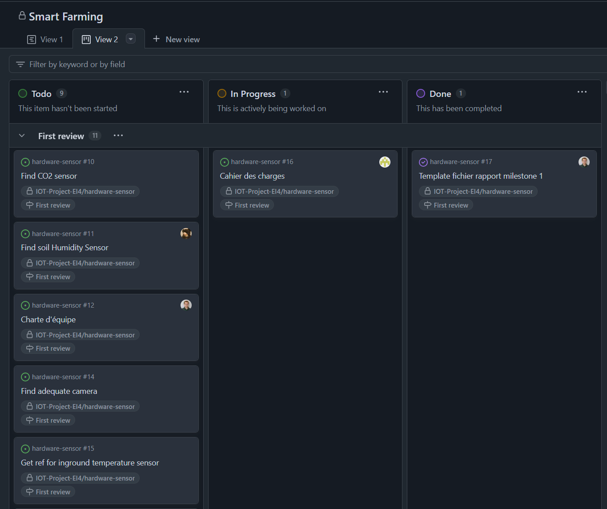

# Milestone 1

## Structure de découpage du projet, PBS : Product Breakdown Structure

## L’organigramme des tâches, WBS : Work Breakdown Structure

## Gestions des risques, AMDEC

## Gestion des tâches et du code, Gantt et Kanban (tableau de bord)

Nous avons décidé d'utiliser les outils intégrés dans GitHub pour gérer notre projet. Nous avons donc utilisé les `issues` pour lister les tâches à réaliser, les `milestones` pour définir les étapes du projet et les projets pour organiser les tâches.

Tous ces éléments sont accessibles depuis le tableau de bord du projet dans lequel plusieurs vues sont disponibles telles que le tableau `kanban`, le tableau de bord des `issues` et `pull requests` et le Gantt.

Vue Kanban : [https://github.com/orgs/IOT-Project-EI4/projects/3/views/2](https://github.com/orgs/IOT-Project-EI4/projects/3/views/2)

Vue Gantt : [https://github.com/orgs/IOT-Project-EI4/projects/3/views/1](https://github.com/orgs/IOT-Project-EI4/projects/3/views/1)

## Communication

Pour la communication, nous avons mis en place un groupe WhatsApp pour les échanges rapides par messages et nous utiliserons aussi les outils de GitHub pour l'assignation des nouvelles tâches.

## Plannification

Pour l'organisation et les revues en groupes, nous allons utiliser les horaires de cours prévu pour le projet. Nous avons aussi prévu des revues juste avant l'oral de chaque rendu pour s'assurer que tout est prêt.

Voici une estimation de la plannification des différentes phases du projet du 29 Janvier au 8 Avril :

## Charte d'équipe

La charte d'équipe est disponible ici : [Charte d'équipe](management/charte.md)

## Fiches d'auto évaluation

[Valentin Le Lievre](management/fiches%20auto%20evaluation/valentin%20le%20lievre.pdf), [Jana Dagher](management/fiches%20auto%20evaluation/jana%20dagher.pdf), [Inessa Kechek](management/fiches%20auto%20evaluation/inessa%20kechek.pdf), [Joakim Lagarde](management/fiches%20auto%20evaluation/joakim%20lagarde.pdf)

## Tests de perception

[Valentin Le Lievre](management/tests%20de%20perception/valentin%20le%20lievre.xlsx), [Jana Dagher](management/tests%20de%20perception/jana%20dagher.xlsx), [Inessa Kechek](management/tests%20de%20perception/inessa%20kechek.xlsx), [Joakim Lagarde](management/tests%20de%20perception/joakim%20lagarde.xlsx)

## Schéma fonctionnel et description des fonctionnalités

Description des fonctionnalités :

- captage de la température et de l'humidité du sol en profondeur
- captage de la température et de l'humidité du sol en surface
- captage da la luminiosté ainsi que son spectre de couleur
- captage du taux de CO2 ambiant
- captage de la température et de l'humidité de l'air
- camera pour prendre des images
- communication LoRaWAN pour envoyer les données (sauf images)
- communication 5G (ou wifi au besoin) pour envoyer les images
- alimentation par batterie et panneau solaire
- interface web pour visualiser les données

 

## Cahier des charges

Le cahier des charges est disponible ici : [Cahier des charges](cahier%20des%20charges.md)

## Liste du matériel nécessaire

La liste du matériel que nous avons sélectionné est disponible ici : [Liste matériel](hardware%20list.md)

## Budget prévisionnel

### Matériel

### Main-d'œuvre

### Total

## Bibliographie

Liens vers les ressources utilisées : [Bibliographie.md](management/bibliographie.md)
