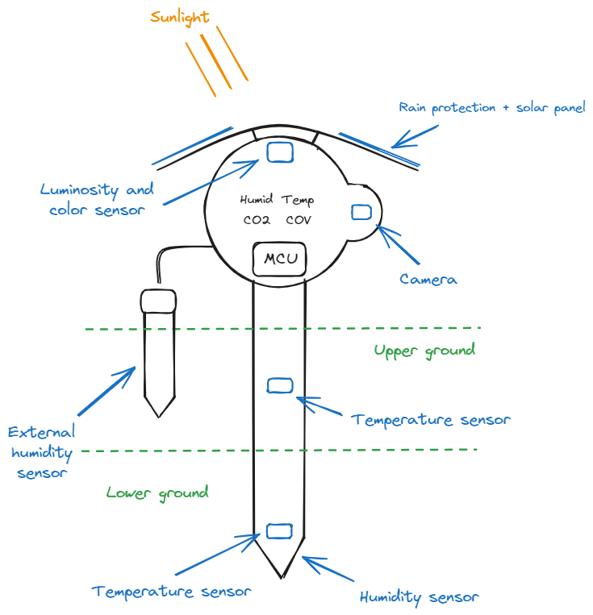

# Cahier des Charges - Projet IoT Smart Farming

## 1. Introduction

### 1.1 Contexte

L’agriculture sous serre permet un meilleur contrôle des conditions climatiques et des ressources. L’objectif de ce projet est d’optimiser la gestion des paramètres environnementaux d’une serre grâce à un système IoT intelligent. Composé de capteurs autonomes, ce système permettra à l'utilisateur de suivre l'état de ses plantations à distance via interface web.  

### 1.2 Objectifs

- Surveiller en temps réel les paramètres clés (température, humidité, luminosité, etc.)  
- Fournir une interface utilisateur pour la visualisation et le contrôle à distance  
- Optimiser la consommation d’énergie et d’eau  

### 1.3 Périmètre

Ce projet concerne uniquement une serre de 15 mètres de diamètre à Saint-Cyr l'école, équipée de capteurs connectés.  

## 2. Description du Besoin

### 2.1 Fonctionnalités attendues

- 📡 **Acquisition de données** : capteurs de température, humidité, CO₂, luminosité et d'image, en option le ph et les paramètres NPK
- 📲 **Communication** : transmission des données via LoRaWAN, Wi-Fi ou 5G
- 📊 **Interface utilisateur** : application web / mobile pour supervision et alertes  

## 3. Contraintes

### 3.1 Techniques

- Microcontrôleur : **F1 de SG Wireless**  
- Communication : **LoRa / Wi-Fi / 5G / BLE**  
- Alimentation : **Batterie + panneaux solaires**  
- Logiciel : **Firmware embarqué + Backend cloud + Application web/mobile**

### 3.2 Réglementaires

- Respect des normes environnementales et électriques  
- Conformité aux réglementations IoT (GDPR, LPD, LoRaWAN OTAA, etc.)  

### 3.3 Budget

- Coût matériel estimé : **220 €**
- Développement du système : **22 000 €**
- Budget estimé : **25 000 €**

## 4. Architecture du Système

### 4.1 Schéma général

Voici le schéma d'un module :

### 4.2 Composants  

Pour chaque module :

| Type                | Composant                       | Quantité      |
| ------------------- | ------------------------------- | ------------- |  
| Microcontrôleur     | F1 de SG Wireless               | 1             |  
| Capteur Temp/Hum    | DF Robot inground soil humidity | 2             |  
| Capteur CO₂         | SCD 40                          | 1             |
| Appareil Photo      | Module camera OV5640            | 1             |  
| Communication       | Module Lora / 5G intégré au MCU | 1             |  

Ce qui fait pour 36 un total de `6 (nb de modules produit) * 6` composants.

## 4. Cahier des Charges Fonctionnel

- **Collecte et suivi des données**  
  - Système automatisé de relevés (température, humidité, CO₂, luminosité, etc.)  
  - Interface de consultation en temps réel (application web ou mobile)  
- **Gestion des alertes**  
  - Notifications en cas de dépassement de seuil ou de panne d’équipement  
  - Paramétrage personnalisé des seuils et types d’alertes  
- **Contrôle à distance**  
  - Activation/désactivation de dispositifs (ventilation, éclairage, arrosage)  
  - Possibilité d’automatiser certaines actions via scénarios préconfigurés  
- **Rapports et historique**  
  - Enregistrement et exportation des données au format CSV ou PDF  
  - Visualisation graphique sur des périodes définies  

## 5. Cahier des Charges Technique

- **Architecture matérielle**  
  - Capteurs compatibles LoRaWAN, Wi-Fi ou 5G  
  - Modules microcontrôleurs à faible consommation (ESP32, STM32, etc.)  
- **Architecture logicielle**  
  - Serveur de données (cloud ou local) pour stocker l’historique et gérer les alertes  
  - Application web/mobiles développées en frameworks modernes (ex. React, Angular)  
- **Protocoles de communication**  
  - Communication chiffrée pour protéger la confidentialité et l’intégrité des données  
  - Mise en place d’un broker MQTT ou équivalent pour la gestion des messages  
- **Contraintes de performance**  
  - Alimentation par batterie ou solaire pour les capteurs  
  - Faible latence pour la remontée d’informations et la transmission des commandes  

## 6. Interfaces Utilisateur

### 6.1 Dashboard

- Graphiques temps réel  
- Alertes et notifications  

### 6.2 API et Cloud

- API REST pour l’accès aux données  
- Stockage des mesures et historique dans une base de données

## 7. Caractérisation des fonction

Tableau des fonctions :

| Fonctions de service              | Critères d'appréciation                            | Niveau d'appréciation / importance | Flexibilité |
| --------------------------------- | -------------------------------------------------- | ----------------------- | ------------- |
| Acquisition de la température proche du sol, et à 2 niveaux de profondeur | Précision des mesures à ± 0.5° C| Élevé | Moyenne|
| Acquisition de l'humidité au sol, et à 2 niveaux de profondeur | Précision des mesures à ± 1% | Élevé | Moyenne       |
| Acquisition de l'intensité lumineuse| Précision à ± 1 Lux | Élevé | Moyenne       |
| Acquisition du spectre de la lumière| Différentiation RGB | Élevé | Faible |
| Acquisition du taux de CO₂|Précision à ± 40 ppm (5%)  | Élevé | Faible |
| Photographie des plantes |Image de qualité correcte, 5 Mpx | Élevé | Faible |
| Transmission des données          | Taux de réussite, couverture, latence              | Élevé                   | Faible        |
| Traitement et analyse             | Rapidité, exactitude, sécurité                     | Moyen                   | Élevée        |
| Interface Dashboard               | Clarté, ergonomie, temps de réponse                | Élevé                   | Moyenne       |

## 8. Conclusion

Ce projet vise à démontrer comment l’IoT peut améliorer la gestion des serres agricoles en automatisant la collecte de données et le contrôle des paramètres environnementaux.
