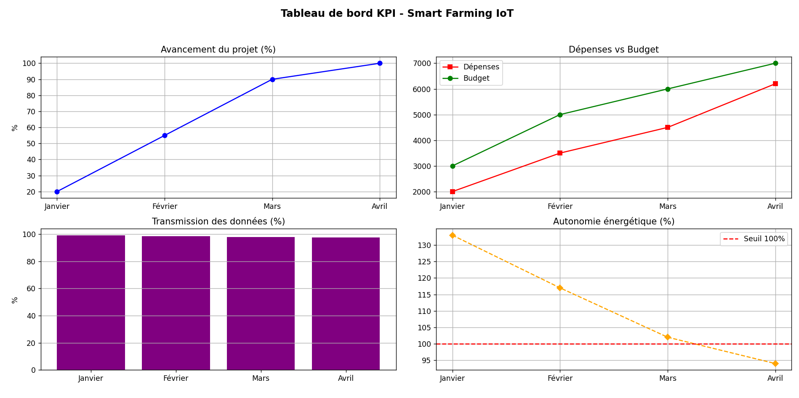

# 📊 Tableau de Bord KPI – Smart Farming  

## 1️⃣ Pilotage du Projet  

| Indicateur | Objectif | Valeur actuelle | Seuil d'alerte | Statut 🚦 |
|------------|----------|----------------|---------------|------------|
| 📅 Avancement du projet (%) | ≥ 90% | **15%** | < 80% | 🟡 En cours |
| 📑 Livrables validés (%) | 100% | **100%** | < 100% | 🟢 OK |
| 🏗 Tâches en retard (%) | < 10% | **5%** | < 20% | 🟢 OK |
| ⏳ Respect du planning (%) | ≥ 95% | **88%** | < 85% | 🟡 En vigilance |

## 2️⃣ Ressources et Budget  

| Indicateur | Objectif | Valeur actuelle | Seuil critique | Statut 🚦 |
|------------|----------|----------------|---------------|------------|
| 👥 Charge de travail (%) | ≤ 100% | **80%** | > 110% | 🟡 Vigilance |
| 💰 Dépenses réalisées (%) | ≤ 100% du budget | **0%** | < 100% | 🟡 En cours |
| 🔧 Disponibilité matériel (%) | ≥ 90% | **50%** | < 80% | 🟡 En cours |

## 3️⃣ Performance du Système IoT  

Les données sont mises à titre de simululation, étant donné que nous n'avons pas encore mis en place notre projet.

| Indicateur | Objectif | Valeur actuelle | Seuil critique | Statut 🚦 |
|------------|----------|----------------|---------------|------------|
| 📡 Transmission des données (%) | ≥ 99% | **97%** | < 95% | 🟡 En vigilance |
| ⚡ Consommation énergétique (Wh) | ≤ 500Wh/mois | **520Wh** | > 550Wh | 🔴 Risque |
| 📊 Précision des capteurs (%) | ≥ 95% | **93%** | < 90% | 🟡 En alerte |

## 4️⃣ Tendance des Indicateurs  

Même problème ici, l'évolution est simulée.

📈 **Évolution des indicateurs clés** :  

- **Avancement du projet** en hausse 📊

- **Respect du budget** maîtrisé 💰  

- **Transmission des données** légèrement en baisse 📡  

- **Consommation énergétique** en dépassement ⚠️  

Si nous avions fait un tableau de bord après la fin de la conception du projet, voici le type de résultat que nous aurions.

## 5️⃣ Actions Correctives  

Voici un exemple d'actions qui peuvent être menées en réponse à des indicateurs de performance alarmants.

| Indicateur concerné | Action recommandée | Responsable | Délai |
|---------------------|-------------------|-------------|-------|
| Charge de travail élevée | Répartition des tâches optimisée | Valentin | 2 semaines |
| Consommation énergétique trop haute | Optimisation des périodes de veille des capteurs | Inessa | 1 mois |
| Tâches en retard | Réévaluation du planning | Jana | 1 semaine |
